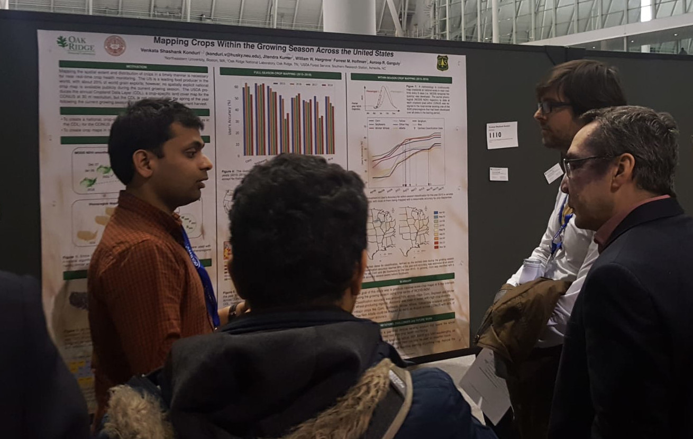

My research is at the intersection of machine learning, computer vision, earth sciences, and high-performance computing. I am interested in efficient unsupervised and supervised learning methods for leveraging ever growing datastores of spatio-temporal earth science observations, forecasts, and projections to understand our environment. Recent projects have included developments of novel deep learning methods for spatio-temporal downscaling, physical model emulation, generating virtual sensors, and cloud tracking. 

# Bio

Shashank is a PhD candidate enrolled in the Interdisciplinary Engineering program at Northeastern University, Boston. He is advised by Prof. [Auroop R. Ganguly](https://coe.northeastern.edu/people/ganguly-auroop/) and is part of the [Sustainability and Data Sciences Lab](https://web.northeastern.edu/sds/). He is currently working as a research intern in the [Computational Sciences and Engineering Division](https://www.ornl.gov/division/csed) at the [Oak Ridge National Laboratory](https://www.ornl.gov/), TN. Shashank completed his Bachelors in Agricultural and Food Engineering and Masters in Financial Engineering from the [Indian Institute of Technology Kharagpur (IIT Kharagpur)](http://www.iitkgp.ac.in/), India in 2015.

# Awards

[**Shashank Konduri wins 1st Place Poster Presentation at American Meteorological Society’s 100th Annual Meeting**](https://cee.northeastern.edu/news/shashank-konduri-wins-1st-place-poster-presentation-at-american-meteorological-societys-100th-annual-meeting/)
