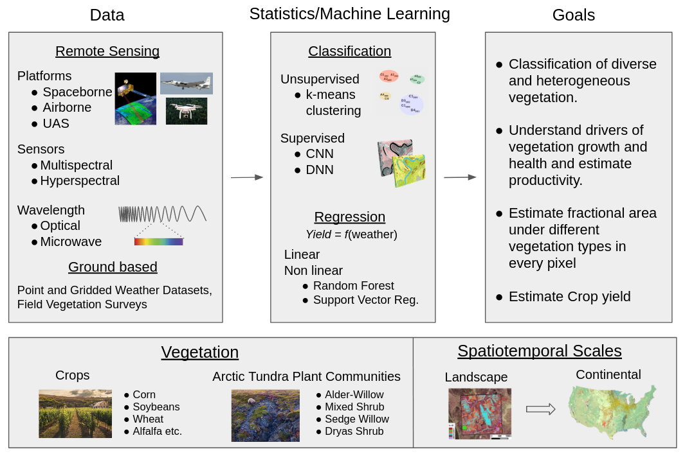

My research is focused on monitoring vegetation using a combination of remote sensing data and machine learning methods. I have experience working with earth observing data from different sensors (multispectral/hyperspectral/lidar), mounted on various platforms (spaceborne/airborne) and collected across different spatiotemporal scales to study diverse vegetation types (crops/arctic tundra shrubs/tropical savannas). In collaboration with eminent scientists at reputed government agencies such as NASA, Oak Ridge National Laboratory (ORNL) and the US Forest Service, I have developed and deployed spatiotemporal data mining methods for improved scientific understanding and enhanced predictive modeling.

  

Over the years, I have built a strong background in the diverse areas of remote sensing, data science, machine learning, hydrology and climate science. I have published my research in high-impact journals and presented at a variety of conferences, spanning different focus areas like computer science, geophysics and landscape ecology.  

# Bio

Shashank is a Post-Doctoral Associate in the Biospheric Sciences Laboratory at NASA's Goddard Space Flight Center. He has a joint affiliation with the Earth System Science Interdisciplinary Center at the University of Maryland, College Park. He graduated with a PhD degree in Interdisciplinary Engineering from Northeastern University, Boston in May, 2021. As a graduate student, he also worked as a Geospatial Data Scientist intern in the [Computational Sciences and Engineering Division](https://www.ornl.gov/division/csed) at [Oak Ridge National Laboratory](https://www.ornl.gov/), TN. Shashank completed his Bachelors in Agricultural and Food Engineering and Masters in Financial Engineering from the [Indian Institute of Technology Kharagpur (IIT Kharagpur)](http://www.iitkgp.ac.in/), India in 2015.

# PhD Big Picture

**Understanding the Distribution of Vegetation and its Environmental Drivers using Machine Learning Methods**  

{:width="95%"}

# Featured

[Onto NASA's Goddard Space Flight Center](https://coe.northeastern.edu/news/onto-nasas-goddard-space-flight-center/)   {:width="25%"}

[Shashank Konduri wins 1st Place Poster Presentation at American Meteorological Society’s 100th Annual Meeting](https://cee.northeastern.edu/news/shashank-konduri-wins-1st-place-poster-presentation-at-american-meteorological-societys-100th-annual-meeting/)   {:width="45%"}

[Distinguished Dean's Fellowship](https://phd.northeastern.edu/university-fellows-and-scholars/)  
This prestigious fellowship is awarded to the most exceptional PhD applicants at Northeastern University.
