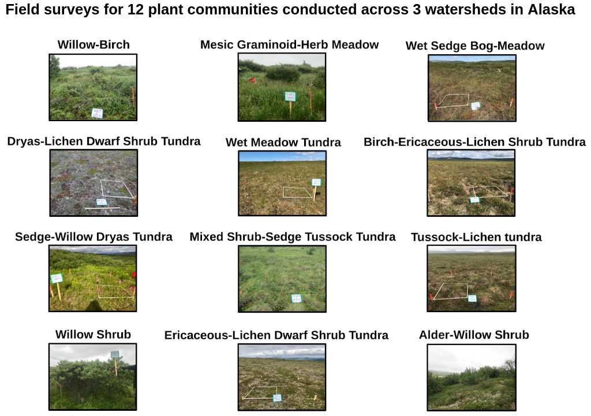
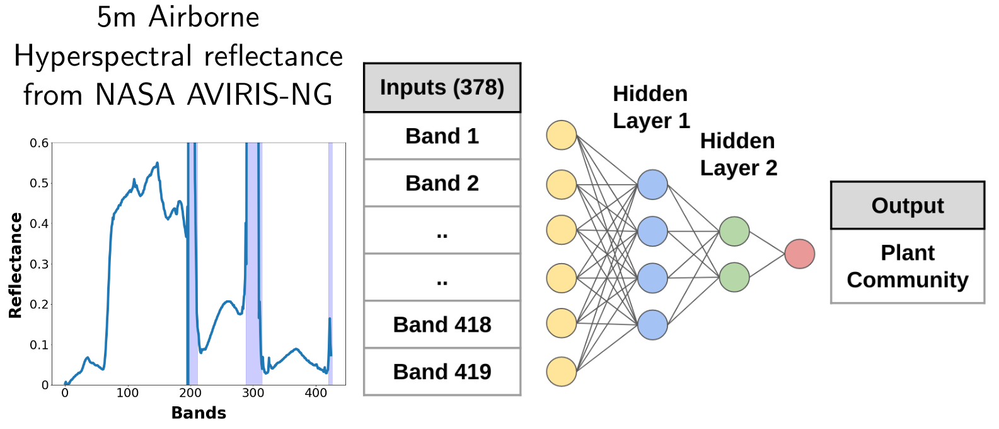
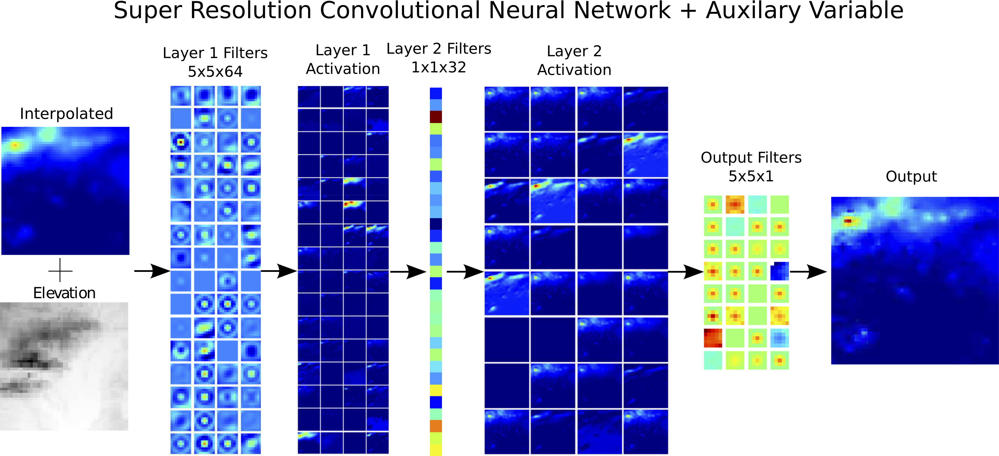

# Understanding the Patterns and Drivers of Arctic Tundra Plant Communities

{:width="50%"}
{:width="45%" style="padding-bottom:28px"}

**Authors:** Venkata Shashank Konduri, [Jitendra Kumar](https://www.ornl.gov/staff-profile/jitendra-kumar), [Forrest M. Hoffman](https://www.ornl.gov/staff-profile/forrest-m-hoffman), [Verity, G. Salmon](https://www.ornl.gov/staff-profile/verity-g-salmon), [Colleen M. Iversen](https://www.ornl.gov/staff-profile/colleen-m-iversen), [Amy L. Breen](https://news.uaf.edu/expertsguide/amy-breen/), [William W. Hargrove](https://www.srs.fs.usda.gov/staff/825)   
**Abstract:** The Arctic is undergoing rapid changes in climate, vegetation composition and productivity. To understand the impacts of climate change on the function of Arctic tundra ecosystems, it is crucial to understand vegetation distribution and heterogeneity across large spatial scales. Knowledge of the environmental drivers controlling current vegetation composition and distribution is necessary for modeling potential shifts under a warming climate. 

Our study was focused on three watersheds in the Seward Peninsula of Alaska, where field surveys were conducted as part of the US DOE’s NGEE-Arctic project. Using airborne hyperspectral imagery from NASA AVIRIS-NG, we developed a Deep Neural Network-based classifier to create a high resolution (5m) map of Arctic tundra plant communities with an accuracy exceeding 80%. Analysis of landscape patterns, using area and aggregation based metrics, show Alder-Willow Shrub and Tussock-Lichen Tundra communities occupy a greater proportion of the landscape and are more clumped together compared to Mesic Graminoid Herb Meadow and Sedge-Willow-Dryas Tundra communities.

We also developed an Environmental Niche Model to understand the relative importance of various environmental drivers in determining the presence/absence of plant communities. Preliminary results show that microtopography (e.g elevation) and soil moisture are the primary drivers of vegetation distribution at the landscape scale. Keystone species, like nitrogen-fixing Alder shrubs, also influence the nutrient availability and vegetation communities in their hydrologically connected downslope neighborhood. High resolution maps of plant communities will provide a better representation of above-ground trait variability in Earth System Models, and will provide data for model parameterization, benchmarking and validation. Insights from niche modeling could improve our understanding of mechanisms and environmental drivers of vegetation distribution and succession.  
**Slides:** [Oral presentation at AGU 2019](./slides/AGU_Presentation_2019.pdf)

# Quantifying Uncertainty in Discrete-Continuous and Skewed Data with Bayesian Deep Learning 

**KDD 2018 - Research Track**  
**Authors:** Thomas Vandal, Evan Kodra, Sangram Ganguly, Jennifer Dy, Rama Nemani, & Auroop Ganguly  
**Abstract:** Deep Learning (DL) methods have been transforming computer vision with innovative adaptations to other domains including climate change. For DL to pervade Science and Engineering (S&EE) applications where risk management is a core component, well-characterized uncertainty estimates must accompany predictions. However, S&E observations and model-simulations often follow heavily skewed distributions and are not well modeled with DL approaches, since they usually optimize a Gaussian, or Euclidean, likelihood loss. Recent developments in Bayesian Deep Learning (BDL), which attempts to capture uncertainties from noisy observations, aleatoric, and from unknown model parameters, epistemic, provide us a foundation. Here we present a discrete-continuous BDL model with Gaussian and lognormal likelihoods for uncertainty quantification (UQ). We demonstrate the approach by developing UQ estimates on “DeepSD’‘, a super-resolution based DL model for Statistical Downscaling (SD) in climate applied to precipitation, which follows an extremely skewed distribution. We find that the discrete-continuous models outperform a basic Gaussian distribution in terms of predictive accuracy and uncertainty calibration. Furthermore, we find that the lognormal distribution, which can handle skewed distributions, produces quality uncertainty estimates at the extremes. Such results may be important across S&E, as well as other domains such as finance and economics, where extremes are often of significant interest. Furthermore, to our knowledge, this is the first UQ model in SD where both aleatoric and epistemic uncertainties are characterized.  
**Paper:** [https://www.kdd.org/kdd2018/accepted-papers/view/quantifying-uncertainty-in-discrete-continuous-and-skewed-data-with-bayesia](https://www.kdd.org/kdd2018/accepted-papers/view/quantifying-uncertainty-in-discrete-continuous-and-skewed-data-with-bayesia)  
**Code:** [https://github.com/tjvandal/discrete-continuous-bdl](https://github.com/tjvandal/discrete-continuous-bdl)

# DeepSD: Generating high resolution climate change projections through single image super-Resolution  

{:width="72%"}
{:width="26%"}

**KDD 2017 - Applied Data Science Track - Runner-up BEST PAPER**  
**Authors:** Thomas Vandal, Evan Kodra, Sangram Ganguly, Andy Michaelis, Rama Nemani, and Auroop Ganguly  
**Abstract:** The impacts of climate change are felt by most critical systems, such as infrastructure, ecological systems, and power-plants. However, contemporary Earth System Models (ESM) are run at spatial resolutions too coarse for assessing effects this localized. Local scale projections can be obtained using statistical downscaling, a technique which uses historical climate observations to learn a low-resolution to high-resolution mapping. Depending on statistical modeling choices, downscaled projections have been shown to vary significantly terms of accuracy and reliability. The spatio-temporal nature of the climate system motivates the adaptation of super-resolution image processing techniques to statistical downscaling. In our work, we present DeepSD, a generalized stacked super resolution convolutional neural network (SRCNN) framework for statistical downscaling of climate variables. DeepSD augments SRCNN with multi-scale input channels to maximize predictability in statistical downscaling. We provide a comparison with Bias Correction Spatial Disaggregation as well as three Automated-Statistical Downscaling approaches in downscaling daily precipitation from 1 degree (~100km) to 1/8 degrees (~12.5km) over the Continental United States. Furthermore, a framework using the NASA Earth Exchange (NEX) platform is discussed for downscaling more than 20 ESM models with multiple emission scenarios. 
**Paper:** [https://www.kdd.org/kdd2017/papers/view/deepsd-generating-high-resolution-climate-change-projections-through-single](https://www.kdd.org/kdd2017/papers/view/deepsd-generating-high-resolution-climate-change-projections-through-single) 
**Code:** [https://github.com/tjvandal/deepsd](https://github.com/tjvandal/deepsd)
