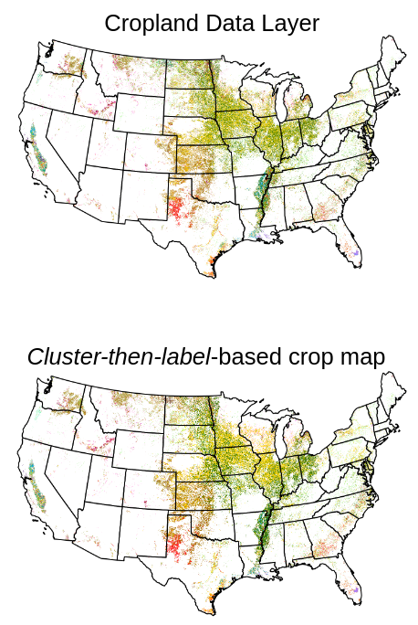
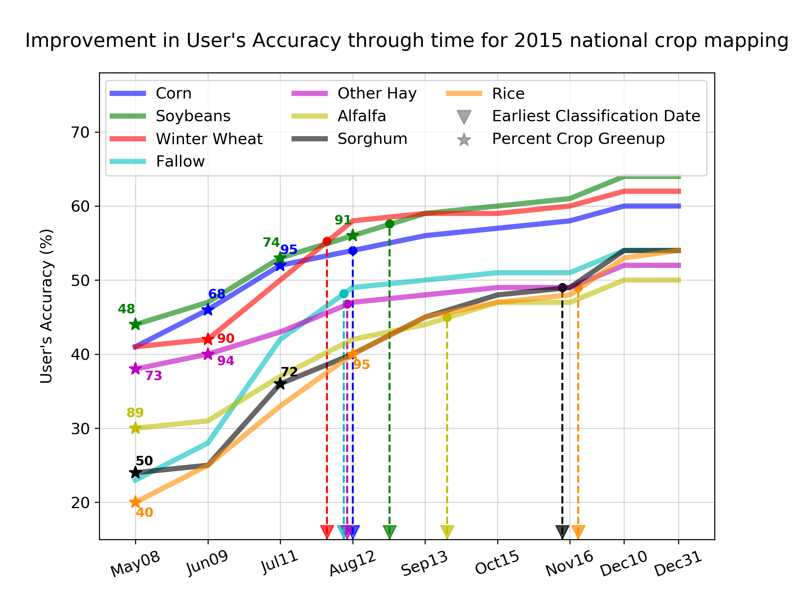

# Understanding the Patterns and Drivers of Arctic Tundra Plant Communities

{:width="50%"}
{:width="45%" style="padding-bottom:60px"}

**Authors:** Venkata Shashank Konduri, [Jitendra Kumar](https://www.ornl.gov/staff-profile/jitendra-kumar), [Forrest M. Hoffman](https://www.ornl.gov/staff-profile/forrest-m-hoffman), [Verity, G. Salmon](https://www.ornl.gov/staff-profile/verity-g-salmon), [Colleen M. Iversen](https://www.ornl.gov/staff-profile/colleen-m-iversen), [Amy L. Breen](https://news.uaf.edu/expertsguide/amy-breen/), [William W. Hargrove](https://www.srs.fs.usda.gov/staff/825)   
**Abstract:** The Arctic is undergoing rapid changes in climate, vegetation composition and productivity. To understand the impacts of climate change on the function of Arctic tundra ecosystems, it is crucial to understand vegetation distribution and heterogeneity across large spatial scales. Knowledge of the environmental drivers controlling current vegetation composition and distribution is necessary for modeling potential shifts under a warming climate. 

Our study was focused on three watersheds in the Seward Peninsula of Alaska, where field surveys were conducted as part of the US DOE’s NGEE-Arctic project. Using airborne hyperspectral imagery from NASA AVIRIS-NG, we developed a Deep Neural Network-based classifier to create a high resolution (5m) map of Arctic tundra plant communities with an accuracy exceeding 80%. Analysis of landscape patterns, using area and aggregation based metrics, show Alder-Willow Shrub and Tussock-Lichen Tundra communities occupy a greater proportion of the landscape and are more clumped together compared to Mesic Graminoid Herb Meadow and Sedge-Willow-Dryas Tundra communities.

We also developed an Environmental Niche Model to understand the relative importance of various environmental drivers in determining the presence/absence of plant communities. Preliminary results show that microtopography (e.g elevation) and soil moisture are the primary drivers of vegetation distribution at the landscape scale. Keystone species, like nitrogen-fixing Alder shrubs, also influence the nutrient availability and vegetation communities in their hydrologically connected downslope neighborhood. High resolution maps of plant communities will provide a better representation of above-ground trait variability in Earth System Models, and will provide data for model parameterization, benchmarking and validation. Insights from niche modeling could improve our understanding of mechanisms and environmental drivers of vegetation distribution and succession.  
**Slides:** [Oral presentation at AGU 2019](./slides/AGU_Presentation_2019.pdf)

# Mapping Crops Within the Growing Season Across the United States

{:width="30%"}
{:width="65%"}

**Manuscript Accepted, Remote Sensing of Environment**  
**Won the 1st place poster presentation among student entries in the hydrology section of the American Meteorological Society (AMS) annual meeting 2020**  
**Authors:** Venkata Shashank Konduri, [Jitendra Kumar](https://www.ornl.gov/staff-profile/jitendra-kumar), [William W. Hargrove](https://www.srs.fs.usda.gov/staff/825), [Forrest M. Hoffman](https://www.ornl.gov/staff-profile/forrest-m-hoffman) & [Auroop Ganguly](https://coe.northeastern.edu/people/ganguly-auroop/)  
**Abstract:** Timely and accurate knowledge about the geospatial distribution of crops at regional to continental scalesis crucial for forecasting crop production and estimating crop water use. The United States (US) is one of the leading food-producing countries, but lacks a nationwide high resolution crop-specific land cover map available publicly during the current growing season. The goal of this study was to map crops across the Continental US (CONUS) before the harvest, and to estimate the earliest date of classification by which crops can be mapped with sufficient accuracy (90% of full-season accuracy). The study employed a scalable cluster-then-label model that was trained on multiple years of MODIS NDVI using ground truth data in the form of US Department of Agriculture (USDA) Cropland Data Layer (CDL) products. The first step in the crop classification was to perform Multivariate Spatio-Temporal Clustering (MSTC) of annual MODIS-derived NDVI trajectories to create phenologically similar regions, or phenoregions. The second step was to assign crop labels to phenoregions based on spatial concordance between phenoregions and crop classes from CDL using Mapcurves. Assigning crop labels to phenoregions was performed within ecoregions to reduce classification errors due to spatial variability in phenology caused by variations in climate, agricultural practices, and growing conditions. The crop classifier was trained and validated on the years 2008–2014, then tested independently on 2015–2018. Ecoregion-level crop classification performed better than state-level and CONUS-level classification. Pixel-wise accuracy of classification for eight major crops by area was around 70% across the major corn-, soybeans- and winter wheat-producing areas, whereas regions characterized by high crop diversity had slightly lower accuracy. Classification accuracy for dominant crops like corn, soybeans, winter wheat, fallow/idle cropland and other hay/non alfalfa improved with time as they grew, reaching 90% of year-end accuracy by the end of August over each of the four unseen years in the test period. For corn and soybeans, the earliest dates of classification were found to be much earlier in the central regions of the Corn Belt (parts of Iowa, Illinois and Indiana) than in peripheral areas. The ability to map growing crops may permit near real-time monitoring of the health status and vigor of agricultural crops nationally.  
**Paper:**   
**Code:** [https://github.com/kvshashank/Shashank_Codes/tree/master/CONUS_crop_mapping](https://github.com/kvshashank/Shashank_Codes/tree/master/CONUS_crop_mapping)

# DeepSD: Generating high resolution climate change projections through single image super-Resolution  

{:width="72%"}
{:width="26%"}

**KDD 2017 - Applied Data Science Track - Runner-up BEST PAPER**  
**Authors:** Thomas Vandal, Evan Kodra, Sangram Ganguly, Andy Michaelis, Rama Nemani, and Auroop Ganguly  
**Abstract:** The impacts of climate change are felt by most critical systems, such as infrastructure, ecological systems, and power-plants. However, contemporary Earth System Models (ESM) are run at spatial resolutions too coarse for assessing effects this localized. Local scale projections can be obtained using statistical downscaling, a technique which uses historical climate observations to learn a low-resolution to high-resolution mapping. Depending on statistical modeling choices, downscaled projections have been shown to vary significantly terms of accuracy and reliability. The spatio-temporal nature of the climate system motivates the adaptation of super-resolution image processing techniques to statistical downscaling. In our work, we present DeepSD, a generalized stacked super resolution convolutional neural network (SRCNN) framework for statistical downscaling of climate variables. DeepSD augments SRCNN with multi-scale input channels to maximize predictability in statistical downscaling. We provide a comparison with Bias Correction Spatial Disaggregation as well as three Automated-Statistical Downscaling approaches in downscaling daily precipitation from 1 degree (~100km) to 1/8 degrees (~12.5km) over the Continental United States. Furthermore, a framework using the NASA Earth Exchange (NEX) platform is discussed for downscaling more than 20 ESM models with multiple emission scenarios. 
**Paper:** [https://www.kdd.org/kdd2017/papers/view/deepsd-generating-high-resolution-climate-change-projections-through-single](https://www.kdd.org/kdd2017/papers/view/deepsd-generating-high-resolution-climate-change-projections-through-single) 
**Code:** [https://github.com/tjvandal/deepsd](https://github.com/tjvandal/deepsd)
